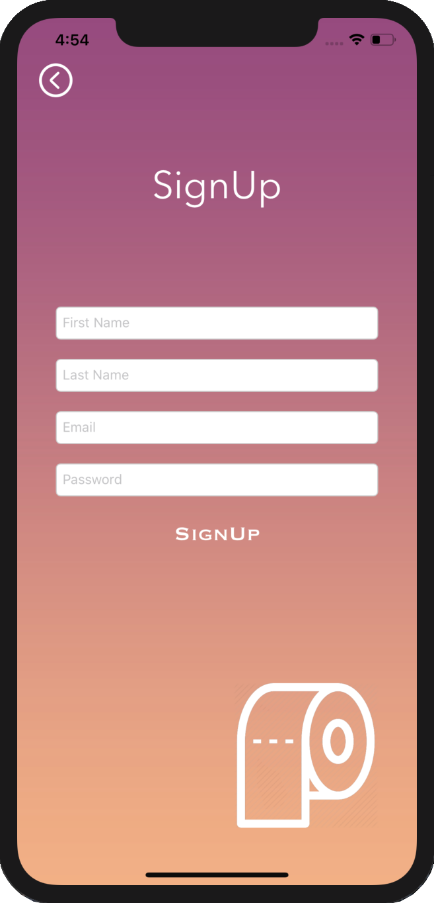

# Papr

<h2>Overview</h2>

Papr is a WIP iOS mobile app that tells you which stores near you are selling toilet paper during a time of crisis. The application was made in Swift and works with Google Firebase to allow the user to signup and login to their account using their email and password.  It connects with the Google Maps third party API to locate stores near you where you can buy supplies for an upcoming self isolation/quarentine event.  After making an account and allowing the app to access your location, the closest stores will be shown to the user.

<h2>ScreenShots</h2>

  

<h2>User Account Authorization</h2>
The user accounts are store in a Google Firebase database.  When the user fills in all the text fields in the signup-page, the fields are test to ensure they are correctly filled our and formated, and the password is tested to ensure it is at least eight characters, contains at least one number, and at least one special character.  The follow code is then executed in order to add the user to the Firestore database.
<br>

```
Auth.auth().createUser(withEmail: email, password: pass) { (authResult, err) in
    if err != nil {self.showError(msg: "Error creating user")}
    else {
          let db = Firestore.firestore()
          
          db.collection("users").addDocument(data: ["firstName": firstname, "lastName": lastname, "uid": authResult!.user.uid  ]) { (errorz) in
          if errorz != nil {
                self.showError(msg: "Something went wrong")}
          }else{
                self.pushToHome()
          }
     }
}
```
