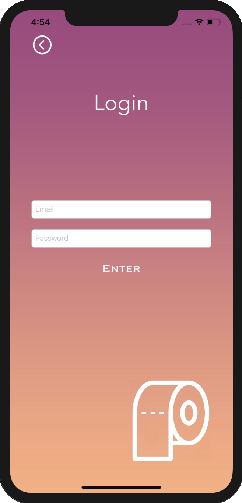

# Papr

Papr is the iOS mobile app that tells you which stores near you are selling toilet paper during a time of crisis

  

The application was made in Swift and works with Google Firebase to allow the user to signup and login to their account using their email and password.
